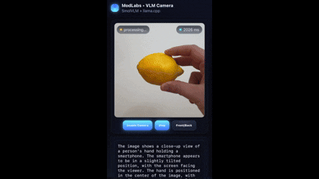

# modlabs-smolVLM

llama.cpp server with SmolVLM 500M to get real-time object detection, modded by modlabs  

Mobile/desktop opensource **Realtime Camera UI** with a local `llama.cpp` server (SmolVLM 500M).  
- Works fully **offline** on your LAN  
- HTTPS-enabled so **mobile browsers can use the camera**  
- One command to serve the web UI and forward API calls  


---

## Quick Start

### 1. Install `llama.cpp`

**Mac (with Homebrew):**
```bash
brew install cmake
git clone https://github.com/ggerganov/llama.cpp
cd llama.cpp
make -j
```

**Windows (with CMake + MSVC):**
```powershell
git clone https://github.com/ggerganov/llama.cpp
cd llama.cpp
cmake -B build
cmake --build build --config Release
```

👉 The compiled binaries will be inside:

* `./build/bin/` (Windows)
* `./` (Mac/Linux)

---

### 2. Run `llama-server`

Download the SmolVLM model (500M) from Hugging Face and run:

```bash
llama-server -hf ggml-org/SmolVLM-500M-Instruct-GGUF \
  --host 0.0.0.0 --port 8080 --jinja
```

**Notes:**
* Add `-ngl 99` to enable GPU acceleration (NVIDIA / AMD / Intel / Apple Metal).
* You can try other models (e.g., `ggml-org/SmolVLM-1B-Instruct-GGUF`) — just swap the `-hf` flag.
* Keep this terminal **running**.

---

### 3. Clone and install ModLabs

```bash
git clone https://github.com/Modlabs-x1/modlabs-smolVLM
cd modlabs-smolVLM
npm install
```

---

### 4. Configure `.env` and generate HTTPS certs

1. Find your LAN IP:
   * **Mac/Linux:**
     ```bash
     ipconfig getifaddr en0
     ```
   * **Windows PowerShell:**
     ```powershell
     ipconfig
     ```
     (Look for your Wi-Fi / Ethernet IPv4 address, e.g., `192.168.1.199`)

2. Copy `.env.example → .env`:
   ```bash
   cp .env.example .env
   ```

3. Edit `.env` — make sure it looks like this **exactly**:  
   ```env
   LAN_IP=192.168.1.129    # replace with your LAN IP
   PORT=8443
   API_TARGET=http://127.0.0.1:8080
   ```

   > ⚠️ **Important:** Do not accidentally write  
   > `API_TARGET=API_TARGET=http://127.0.0.1:8080`  
   > Only a single `API_TARGET=` is valid.

4. Sanity check your `.env`:  
   ```bash
   node -r dotenv/config -e "console.log(process.env.API_TARGET)" dotenv_config_path=.env
   ```
   Expected:
   ```
   http://127.0.0.1:8080
   ```

5. Generate a self-signed cert for your LAN IP:
   ```bash
   npm install --save-dev dotenv-cli

   npm run cert
   ```

---

### 5. Run the server

```bash
npm run start
```

You should see:

```
HTTPS up at: https://192.168.1.129:8443
Open on phone: https://192.168.1.129:8443/
API proxied via: https://192.168.1.129:8443/v1/chat/completions
```

---

### 6. Open on your phone

* On your phone (same Wi-Fi), go to:
  ```
  https://192.168.1.129:8443/
  ```
* Accept the **self-signed certificate warning** once
* Tap **Enable Camera** → **Start**
* Use **Front/Back** to switch cameras
* Model response updates every **3 seconds**

---

## 🛠 Troubleshooting

* **TypeError: Cannot read properties of null (reading 'split')**  
  → Your `.env` is broken. Check for duplicate `API_TARGET=` lines and re-run the sanity check in **Step 4.4**.

* **Camera blocked / black screen?**  
  Make sure you opened via `https://` and not plain `http://`.

* **Server unreachable?**  
  Ensure your phone is on the **same Wi-Fi** as your computer.

* **Cert errors on Windows?**  
  Import the `certs/cert.pem` file into your system’s trusted root (optional, otherwise just accept the warning in the browser).

* **Slow responses?**  
  Smaller models (500M) are fast but less accurate. Try bigger models for better results.

---

## ✨ Features

* Futuristic UI  
* Camera (rear/front) switching  
* Fixed **3s interval** processing  
* Works fully offline on your LAN  
* Simple setup (Mac + Windows)  

---
